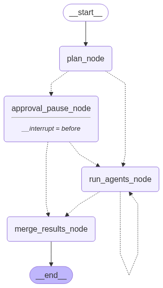

# IT Support Agent 🤖
# IT Support Agent 🤖

A modular, agentic AI system for automating IT support requests. This repository provides a FastAPI-based API, multiple cooperating agents (coordinator, diagnostic, automation, writer) and approval workflows for safe execution of sensitive actions.

Key capabilities:

- Automated diagnosis and remediation
- Script generation (PowerShell/Bash) and validation
- Approval and pause/resume workflow for human-in-the-loop operations
- Extensible agent architecture for adding new skills and tools

---

## Project Snapshot

Below is the workflow used to orchestrate requests and approvals. The image is embedded from the repository root so it will render on GitHub and local markdown viewers.



---

## Quick Start (Windows with bash.exe)

1. Create and activate a virtual environment (bash.exe compatible):

```bash
python -m venv .venv
source .venv/Scripts/activate
```

2. Install dependencies:

```bash
pip install -r requirements.txt
```

3. Run the API locally (uses uvicorn):

```bash
uvicorn app.main:app --reload --host 127.0.0.1 --port 8000
```

4. Open the interactive API docs at: http://127.0.0.1:8000/docs

5. Run tests:

```bash
pytest -q
```

---

## Architecture

- app/main.py — FastAPI application entrypoint
- app/api.py — API routes and request handlers
- app/models.py — Pydantic models and type definitions
- app/agents/ — Agent implementations (coordinator, diagnostic, automation, writer)
- workflows/ — Orchestration logic and graphs

The coordinator agent receives requests, dispatches work to the diagnostic and automation agents, and routes approvals to human reviewers when necessary.

## Environment & Configuration

- Python 3.9+
- Dependencies are listed in `requirements.txt`.
- LLM provider keys (OpenAI or other) should be supplied via environment variables. Example (bash):

```bash
export OPENAI_API_KEY="sk-..."
```

Adjust configuration in the code or add a `.env` loader as needed.

## Usage Examples

- Submit a new IT request via the API route implemented in `app/api.py` (see the route docstrings and OpenAPI docs for concrete schemas).
- The system may pause for approval during automation steps; approved or rejected outcomes are recorded by the coordinator.

## Development Notes

- Add new agents under `app/agents/` and register them in the coordinator.
- Keep unit tests in `test/` alongside example workflows and artifacts.

## Contributing

1. Fork the repo
2. Create a branch: `git checkout -b feat/your-feature`
3. Make changes and add tests
4. Run tests locally: `pytest -q`
5. Open a pull request with a clear description

